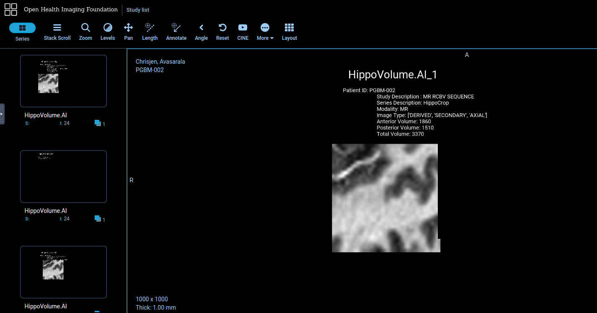

# Report

This reports include the steps I took to reach the final results.

1. Completed all tasks.
2. Launched Orthanc using:  
``` 
bash launch_orthanc.sh
```
3. Launched OHIF using:
``` 
bash launch_OHIF.sh
```
4. Run `send_volume.sh` to test the server that has the following code.
```
storescu 127.0.0.1 4242 -v -aec HIPPOAI +r +sd /data/TestVolumes/Study1
```
5. Run the project using:
```
python inference_dcm.py "/data/TestVolumes/"
```
6. Got the final results

