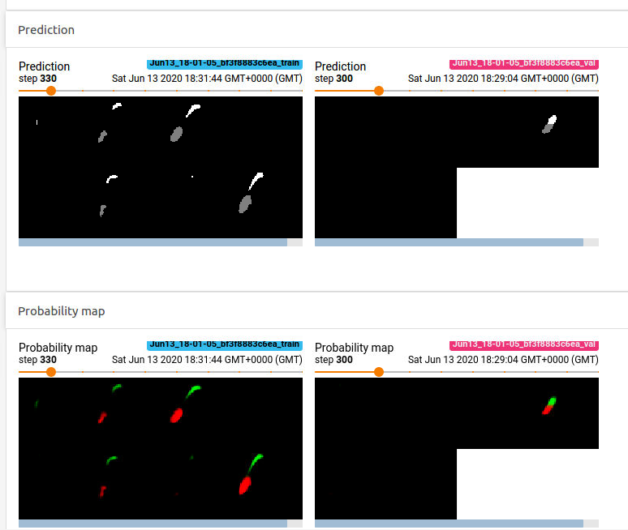
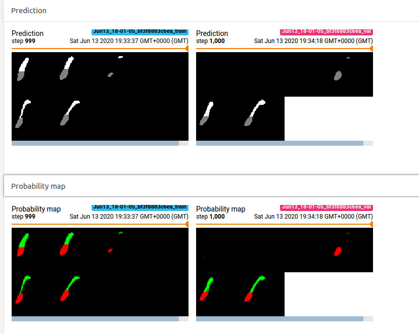
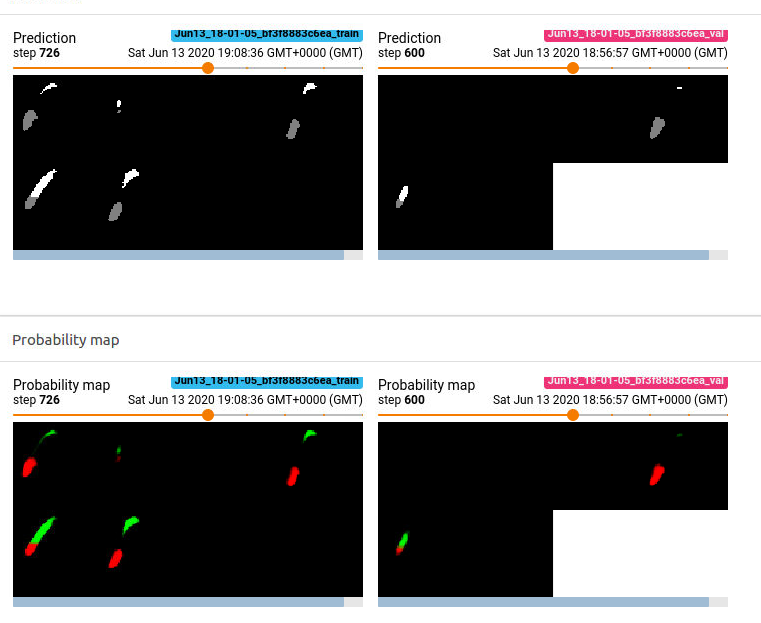

## What is the intended use of the product?  
The algorithm is intended for use to assist radiologists in identifying hippocampus volume, posterior and anterior.

## How was the training data collected?  
*We are using the "Hippocampus" dataset from the Medical Decathlon competition. This dataset is stored as a collection of NIFTI files, with one file per volume, and one file per corresponding segmentation mask. The original images here are T2 MRI scans of the full brain. As noted, in this dataset we are using cropped volumes where only the region around the hippocampus has been cut out. This makes the size of our dataset quite a bit smaller, our machine learning problem a bit simpler and allows us to have reasonable training times.*

The dataset can be found in http://medicaldecathlon.com/. The dataset consists of 263 training and 131 testing images.

## How did you label your training data?  
All data has been labeled and verified by an expert human rater, and with the best effort to mimic the accuracy required for clinical use. This refers to the silver standard.

## How was the training performance of the algorithm measured and how is the real-world performance going to be estimated?
The performance was measured by the Jaccard distance and the Dice score. In real-world, the performance can be measured by radiologists.

## What data will the algorithm perform well in the real world and what data it might not perform well on?
The data should perform well in almost all images of human brains with a clear view of the hippocambus that is the SeriesDescription = "HippoCrop". Otherwise, the algorithm might not perform that good.

Here are the results that show how good the model is.
```
{
  "volume_stats": [
    {
      "filename": "hippocampus_383.nii.gz",
      "dice": 0.9251638469745466,
      "jaccard": 0.8607487237663074
    },
    {
      "filename": "hippocampus_034.nii.gz",
      "dice": 0.9454326198372023,
      "jaccard": 0.8965122927387078
    },
    {
      "filename": "hippocampus_277.nii.gz",
      "dice": 0.9450992555831266,
      "jaccard": 0.8959129667744781
    },
    {
      "filename": "hippocampus_288.nii.gz",
      "dice": 0.9302823497925866,
      "jaccard": 0.8696522391793845
    },
    {
      "filename": "hippocampus_340.nii.gz",
      "dice": 0.9009411389376296,
      "jaccard": 0.8197387518142235
    },
    {
      "filename": "hippocampus_093.nii.gz",
      "dice": 0.9351648351648352,
      "jaccard": 0.8782249742002064
    },
    {
      "filename": "hippocampus_039.nii.gz",
      "dice": 0.9255516014234876,
      "jaccard": 0.8614202437731849
    },
    {
      "filename": "hippocampus_207.nii.gz",
      "dice": 0.9194348988163421,
      "jaccard": 0.8508833922261484
    },
    {
      "filename": "hippocampus_286.nii.gz",
      "dice": 0.9484568384772051,
      "jaccard": 0.9019666269368296
    },
    {
      "filename": "hippocampus_155.nii.gz",
      "dice": 0.9306761565836299,
      "jaccard": 0.8703407880724174
    },
    {
      "filename": "hippocampus_250.nii.gz",
      "dice": 0.9297086212075698,
      "jaccard": 0.8686500140331181
    },
    {
      "filename": "hippocampus_048.nii.gz",
      "dice": 0.9278898795557641,
      "jaccard": 0.8654800116720164
    },
    {
      "filename": "hippocampus_298.nii.gz",
      "dice": 0.889747191011236,
      "jaccard": 0.8013915243516762
    },
    {
      "filename": "hippocampus_282.nii.gz",
      "dice": 0.8596138374899437,
      "jaccard": 0.7537918871252205
    },
    {
      "filename": "hippocampus_358.nii.gz",
      "dice": 0.8720243422230177,
      "jaccard": 0.7730879086004443
    },
    {
      "filename": "hippocampus_305.nii.gz",
      "dice": 0.8507310438626318,
      "jaccard": 0.7402366863905325
    },
    {
      "filename": "hippocampus_355.nii.gz",
      "dice": 0.9229627430607095,
      "jaccard": 0.8569459757442117
    },
    {
      "filename": "hippocampus_225.nii.gz",
      "dice": 0.9225589225589226,
      "jaccard": 0.85625
    },
    {
      "filename": "hippocampus_075.nii.gz",
      "dice": 0.9145299145299145,
      "jaccard": 0.84251968503937
    },
    {
      "filename": "hippocampus_088.nii.gz",
      "dice": 0.935726540847301,
      "jaccard": 0.8792162698412699
    },
    {
      "filename": "hippocampus_376.nii.gz",
      "dice": 0.8996451383960256,
      "jaccard": 0.8175954592363261
    },
    {
      "filename": "hippocampus_123.nii.gz",
      "dice": 0.9388591238575481,
      "jaccard": 0.8847638847638848
    },
    {
      "filename": "hippocampus_287.nii.gz",
      "dice": 0.9456356342509338,
      "jaccard": 0.896877459984256
    },
    {
      "filename": "hippocampus_216.nii.gz",
      "dice": 0.919632265717675,
      "jaccard": 0.8512215207246775
    },
    {
      "filename": "hippocampus_221.nii.gz",
      "dice": 0.8997618532149816,
      "jaccard": 0.8177882723337269
    },
    {
      "filename": "hippocampus_304.nii.gz",
      "dice": 0.8814762242725337,
      "jaccard": 0.7880710659898477
    }
  ],
  "overall": {
    "mean_dice": 0.916027185294127,
    "mean_jaccard": 0.8461264855889409
  },
  "config": {
    "name": "Basic_unet",
    "root_dir": "./out/",
    "n_epochs": 10,
    "learning_rate": 0.0002,
    "batch_size": 8,
    "patch_size": 64,
    "test_results_dir": "./runs"
  }
}
```

Also, below you can find the model performance during training.







