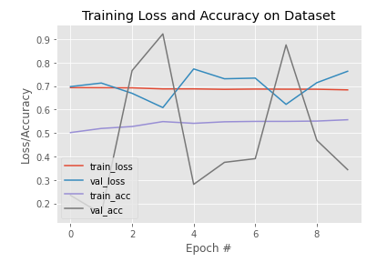
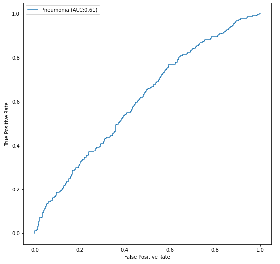
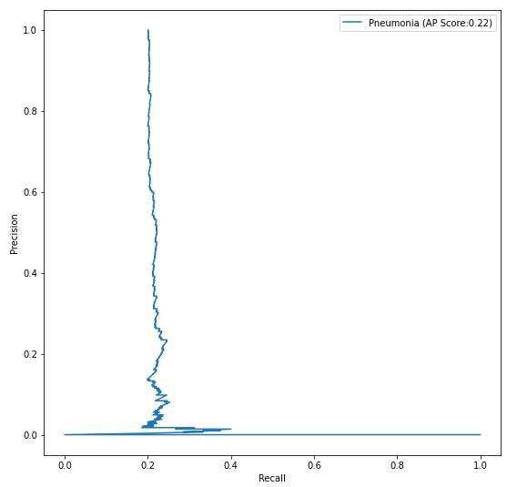
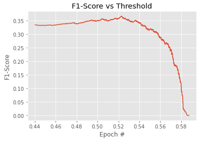
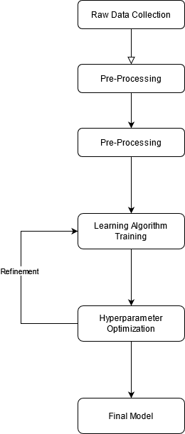
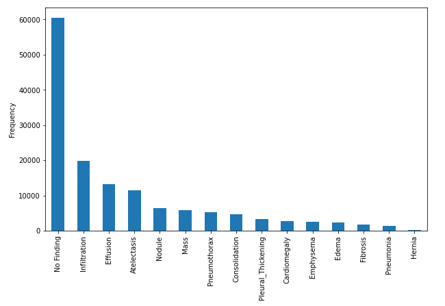
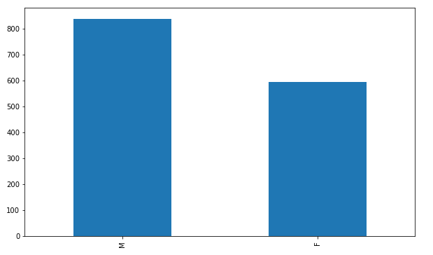

# FDA  Submission

**Your Name:** Mohammad Al-Fetyani

**Name of your Device:** PneumoniaNet 

## Algorithm Description 

### 1. General Information

**Intended Use Statement:**  
This model is intended for use on men and women from 1 to 85 years old who have no previous illnesses or who have one or a combination of the following diseases: atelectasis, heart enlargement, standardization, edema, effusion, emphysema, fibrosis, hernia, infiltration, mass, Creed, pleura thickening and pneumothorax

**Indications for Use:**  
Screening for pneumonia to assist radiologists in non-emergency situations.

**Device Limitations:**  
Requires at least a computer with 2-cores CPU and 8 GB RAM.

**Clinical Impact of Performance:**  
The algorithm is designed for high recall predictions. This means that when the algorithm predicts positive, the patient is likely to have pneumonia. The algorithm tends to classify many positive cases, which many of them are considered false positive, as patients who have no pneumonia may be classified as having pneumonia. The algorithm will produce few false negatives cases as x-rays with pneumonia will probably be correctly classified.

### 2. Algorithm Design and Function

The algorithms uses a deep neural network, specifically VGG16 architecture to classify the presence of pneumonia from x-ray images. The flow starts with image preprocessing where all images are normalized, then the image is fed to the neural network and the network outputs a probability of having pneumonia. If the output probability is higher than a predefined threshold, it is classified as positive.

**DICOM Checking Steps:**  
It is guaranteed that DICOM only contains the following:
* Body Part Examined = CHEST
* Modality = DX
* Patient Position = AP or PA

**Preprocessing Steps:**  
ِImages are resized to 224x224, converted to RGB color channels and normalized to the range of [0,1]

**CNN Architecture:**
The base network is VGG16 pre-trained on ImageNet dataset, followed by:
* Flatten()
* Dense(1024, activation='relu')
* Dropout(0.25)
* Dense(512, activation='relu')
* Dropout(0.25)
* Dense(256, activation='relu')
* Dropout(0.25)
* Dense(1, activation='sigmoid')

### 3. Algorithm Training

**Parameters:**
* Types of augmentation used during training
    * Horizontal flip
    * Random height shift of (+/-)10% of the image max.
    * Random width shift of (+/-)10% of the image max.
    * Random rotation shift of (+/-)20 degrees max.
    * Random shear shift of (+/-)10% max.
    * Random zoom of (+/-)10% max.
* Batch size = 64
* Optimizer learning rate = 1e-4
* Layers of pre-existing architecture that were frozen: First 17 layers of VGG16.
* Layers of pre-existing architecture that were fine-tuned: All dense layers of VGG16 and all additional dense layers.
* Layers added to pre-existing architecture: described above.

The flowchart of the training process is shown below

The hyper-parameters tuning process took me a lot of time. I started with the VGG16 model pre-trained on imagenet and did not freeze any layer. I trained it for 5 epochs and got an f1-score of 23%, which is not that good. I added the the following layers to the model and got 25% f1-score. I tuned many hyper-parameters including, but not limited to, learning rate, optimizer, number of filters and number of hidden units in the dense layers but the f1-score did not improve that much.
* Batch Normalization
* Conv2d layer with 1x1 kernal, 1024 filters, stride of 1, and relu activation function.
* Dropout of 0.5
* Batch Normalization
* Conv2d layer with 1x1 kernal, 256 filters, stride of 1, and relu activation function.
* Dropout of 0.5
* 7x7 AveragePooling2D layer
* Batch Normalization
* Conv2d layer with 1x1 kernal, 1 filter, stride of 1, and sigmoid activation function.
* Reshape to [batch_size, 1]

I also tried a pre-trained VGG16 model with the following dense layers and got 42% f1-score, with precision of 30% and recall of 72%.
* Flatten()
* Dense(1024, activation='relu')
* Dropout(0.25)
* Dense(512, activation='relu')
* Dropout(0.25)
* Dense(256, activation='relu')
* Dropout(0.25)
* Dense(1, activation='sigmoid')

I then changed the base model to the ResNet50 pre-trained on imagenet and kept the above mentioned conv layers. I managed to get an f1-score of 34% after trying out many hyper-parameters. So, I stayed with model that achieved 42% f1-score.

**Final Threshold and Explanation:**  
The final threshold is 0.55 because it gives the highest f1-score.  

We have to make a trade off between recall and precision. High recall means the model will correctly classify all positive cases. High precision means the model will accuratly classify positive cases, which means when the model classifies an image as a positive case, the image will probably be a positive case. However, If we get a high recall model, we will end up with many cases classified as positive. On the other hand, if we get a high precision model, we will end up missing positive cases. So, a trade off between these two is probability the best option.

### 4. Databases

The dataset is obtained from [Kaggle](https://www.kaggle.com/nih-chest-xrays/data). The dataset contains 112,120 chest x-ray images with 1024x1024 resolution. It contains 14 diseases: atelectasis, heart enlargement, standardization, edema, effusion, emphysema, fibrosis, hernia, infiltration, mass, Creed, pleura thickening, pneumothorax, and pneumonia. The figure below shows their distribution. It is to be noted that an image may contain multiple diseases.

The age distribution for people with pneumonia is presented below.

There are 1431 samples with pneumonia and 110689 samples without pneumonia in the dataset. The gender distribution is shown below with 56.5% male and 43.5% female.

**Description of Training Dataset:** 
The training dataset is resampled with replacement to have 50% positive cases of pneumonia and 50% with no pneumonia. The total number of images in the training set becomes 2290 images.

**Description of Validation Dataset:** 
The validation set has 20% positive cases of pneumonia and 80% with no pneumonia. The total number of images in the validation set is 1430 images.

### 5. Ground Truth
The labels are obtained using an NLP approach from the radiologist reports. They are expected to be accurate enough.

### 6. FDA Validation Plan

**Patient Population Description for FDA Validation Dataset:**  
The sample should be taken from men and women aged 1 to 85 years. The sample can include people with previous lung diseases. X-rays should be for chest only with DX modality.

**Ground Truth Acquisition Methodology:**  
X-ray images are validated by 3 different radiologists and an NLP approach, which refers to the silver standard.

**Algorithm Performance Standard:**  
The model should be tested on f1-score and the minimum acceptable f1-score should be 0.387 because I found the following paper states that the radiologists achieved on average an f1-score of 0.387.  https://arxiv.org/pdf/1711.05225.pdf
