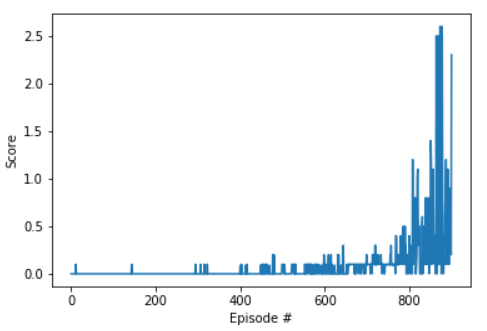

# Learning Algorithm
The algorithm used to train the agents is the Deep Deterministic Policy Gradient algorithm. The algorithm works as follows:
* Define and initialize two networks for each agent, the Actor network that is used to approximate the policy and the critic network which estimate the value function.
* Initialize a shared replay memory to store agents's interactions with the environment.
* Start a loop through a given episodes followed by another loop thorugh each episode until it is solved.
* The training loop consists mainly of two steps for each agent:
	1. __Acting__ where the agents choos an action from the state using the Actor network.
	2. __Learning__ where the Actor network optimize its weights such that the estimated value of the input state is maximized. This is achieved by help of the Critic network which is used as a feedback.
* In each step, a soft update to the __target__ Actor and Critic weights happens where their weights are mixed with 0.01% of the __local__ networks weights.

# Actor Network Architecture 

* The architecture is shown below. 
* The input size is 24 and the output size is 2. 
* The first three layers are followed by relu activation function.
* Last layer is followed by tanh activation function.

```
Actor(
  (fc1): Linear(in_features=24, out_features=256, bias=True)
  (fc2): Linear(in_features=256, out_features=128, bias=True)
  (fc3): Linear(in_features=128, out_features=128, bias=True)
  (fc4): Linear(in_features=128, out_features=2, bias=True)
)
```

# Critic Network Architecture 

* The architecture is shown below. 
* The input size is 52 and the output size is 1. 
* First three layers are followed by relu activation function.
* Last layer is not followed by an activation function.

```
Critic(
  (fc1): Linear(in_features=52, out_features=256, bias=True)
  (fc2): Linear(in_features=256, out_features=128, bias=True)
  (fc3): Linear(in_features=128, out_features=128, bias=True)
  (fc4): Linear(in_features=128, out_features=1, bias=True)
)
```

# Hyperparameters used for training

```
BUFFER_SIZE = int(1e5)  # replay buffer size
BATCH_SIZE = 128        # minibatch size
GAMMA = 0.99            # discount factor
TAU = 1e-2              # for soft update of target parameters
LR_ACTOR = 1e-4         # learning rate of the actor 
LR_CRITIC = 1e-3        # learning rate of the critic
WEIGHT_DECAY = 0        # L2 weight decay
```

# Average rewards over 100 episodes

The average reward over 100 episodes is illustrated below. The environment has been solved in 901 episodes with an average score of 0.5089.



# Future ideas

1. Further tuning to the hyperparameters might help in increasing the score of the agents.
2. Use Asynchronous Actor Critic where multiple agents run independently in parallel and they optimize the network in an asynchronous manner. However, this algorithm will need more computational power.
3. Use Prioritized Experience Replay where important replays are prioritized over other replays.