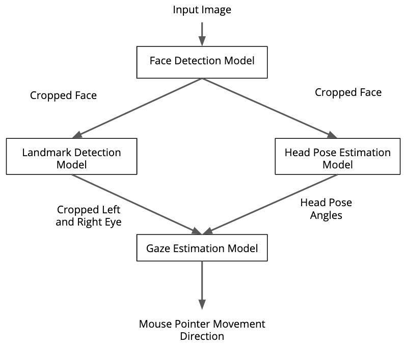

# Computer Pointer Controller
In this project, I have developed a program to control the computer pointer using human eye gaze direction. It can be used directly with camera video stream. The pipeline of the project is shown in the figure below.



## Project Set Up and Installation
To get the projet up and running, you need to do the following:
1. Install [Intel OpenVINO 2020.2.117](https://docs.openvinotoolkit.org/2020.2/index.html).
2. Once it installed run the following command:
	```
	source /opt/intel/openvino/bin/setupvars.sh -pyver 3.5
	```
3. These models need to be installed (They are already contained in models folder):
	- [Face Detection Model](https://docs.openvinotoolkit.org/latest/_models_intel_face_detection_adas_binary_0001_description_face_detection_adas_binary_0001.html)
	- [Facial Landmarks Detection Model](https://docs.openvinotoolkit.org/latest/_models_intel_landmarks_regression_retail_0009_description_landmarks_regression_retail_0009.html)
	- [Head Pose Estimation Model](https://docs.openvinotoolkit.org/latest/_models_intel_head_pose_estimation_adas_0001_description_head_pose_estimation_adas_0001.html)
	- [Gaze Estimation Model](https://docs.openvinotoolkit.org/latest/_models_intel_gaze_estimation_adas_0002_description_gaze_estimation_adas_0002.html)
	
	If you want to download them manually, use the __model__ __downloader__ as follows:
	```
	python /opt/intel/openvino/deployment_tools/open_model_zoo/tools/downloader/downloader.py --name model_name -o models/
	```
	Replace `model_name` with the model you want:
	```
	face-detection-adas-binary-0001
	landmarks-regression-retail-0009
	gaze-estimation-adas-0002
	head-pose-estimation-adas-0001
	```
4. Install dependencies:
	```
	pip install -r requirements.txt
	```

## Demo
To run the program use the following command:
```
python main.py -f ../models/face-detection-adas-binary-0001/FP32/face-detection-adas-binary-0001.xml -fl ../models/landmarks-regression-retail-0009/FP32/landmarks-regression-retail-0009.xml -hp ../models/head-pose-estimation-adas-0001/FP32/head-pose-estimation-adas-0001.xml -g ../models/gaze-estimation-adas-0002/FP32/gaze-estimation-adas-0002.xml -i ../bin/demo.mp4 
```

## Project Structure
```
├── bin
│   └── demo.mp4
├── models
│   ├── face-detection-adas-binary-0001
│   │   └── INT1
│   │       ├── face-detection-adas-binary-0001.bin
│   │       └── face-detection-adas-binary-0001.xml
│   ├── gaze-estimation-adas-0002
│   │   ├── FP16
│   │   │   ├── gaze-estimation-adas-0002.bin
│   │   │   └── gaze-estimation-adas-0002.xml
│   │   ├── FP32
│   │   │   ├── gaze-estimation-adas-0002.bin
│   │   │   └── gaze-estimation-adas-0002.xml
│   │   └── INT8
│   │       ├── gaze-estimation-adas-0002.bin
│   │       └── gaze-estimation-adas-0002.xml
│   ├── head-pose-estimation-adas-0001
│   │   ├── FP16
│   │   │   ├── head-pose-estimation-adas-0001.bin
│   │   │   └── head-pose-estimation-adas-0001.xml
│   │   └── FP32
│   │       ├── head-pose-estimation-adas-0001.bin
│   │       └── head-pose-estimation-adas-0001.xml
│   └── landmarks-regression-retail-0009
│       ├── FP16
│       │   ├── landmarks-regression-retail-0009.bin
│       │   └── landmarks-regression-retail-0009.xml
│       └── FP32
│           ├── landmarks-regression-retail-0009.bin
│           └── landmarks-regression-retail-0009.xml
├── README.md
├── requirements.txt
└── src
    ├── face_detection.py
    ├── facial_landmarks_detection.py
    ├── gaze_estimation.py
    ├── head_pose_estimation.py
    ├── input_feeder.py
    ├── __main__.log
    ├── main.py
    └── mouse_controller.py
```
## Documentation
The command line arguments that my project supports are:
```
usage: main.py [-h] -f FACEDETECTIONMODEL -fl FACIALLANDMARKMODEL -hp HEADPOSEMODEL -g GAZEESTIMATIONMODEL -i INPUT               [-flags FLAGS [FLAGS ...]] [-l CPU_EXTENSION] [-d DEVICE] [-pt PROB_THRESHOLD]
optional arguments:
  -h, --help            show this help message and exit
  -f FACEDETECTIONMODEL, --facedetectionmodel FACEDETECTIONMODEL
                        Path to .xml file of the Face Detection model.
  -fl FACIALLANDMARKMODEL, --faciallandmarkmodel FACIALLANDMARKMODEL
                        Path to .xml file of the Facial Landmark Detection model.
  -hp HEADPOSEMODEL, --headposemodel HEADPOSEMODEL
                        Path to .xml file of the Head Pose Estimation model.
  -g GAZEESTIMATIONMODEL, --gazeestimationmodel GAZEESTIMATIONMODEL
                        Path to .xml file of the Gaze Estimation model.
  -i INPUT, --input INPUT
                        Path to image or video file
  -flags FLAGS [FLAGS ...], --flags FLAGS [FLAGS ...]
                        Specify the flags like "--flags fd hp fld ge" if you want to visualize different models output at each
                        frame,fd for Face Detection, fld for Facial Landmark Detectionhp for Head Pose Estimation, ge for Gaze
                        Estimation.
  -l CPU_EXTENSION, --cpu_extension CPU_EXTENSION
                        MKLDNN (CPU)-targeted custom layers.Absolute path to a shared library with thekernels impl.
  -d DEVICE, --device DEVICE
                        Specify the target device to infer on: CPU, GPU, FPGA or MYRIAD is acceptable. Sample will look for a
                        suitable plugin for device specified (CPU by default)
  -pt PROB_THRESHOLD, --prob_threshold PROB_THRESHOLD
                        Probability threshold for detections filtering(0.5 by default)
```

## Benchmarks
I have run the program, using different precisions, on:
- Intel(R) Xeon(R) CPU @ 2.30GHz
- 4G RAM

I achieved the following results:
* FP32
```
Loading time of the models: 0.43724846839904785 s
Total inference time 2.611088752746582 s
Average inference time 0.04425574157197597 s
FPS 4.519187632970223 frame/second
```

* FP16
```
Loading time of the models: 0.495556116104126 s
Total inference time 2.6080329418182373 s
Average inference time 0.0442039481664108 s
FPS 4.524482728263937 frame/second
```

* INT8
```
Loading time of the models: 0.5068285465240479 s
Total inference time 2.591961622238159 s
Average inference time 0.04393155291929084 s
FPS 4.552536541729618 frame/second
```
## Results
It is obvious from the results above that there is an inverse relationship between the model's precision and the inference time. As the precision of the model decreases, the inference time gets better and better. This is because the models use less memory with lower precision and hence less computations

## Stand Out Suggestions
- I covered some edge cases like handled the cause when no faces get detected.
- I tried different precisions in order to improve the inference time without significant drop in performance
- Allowed the user to select video or camera.

### Edge Cases
1. When no faces get detected in the frame, the program simply skips the frame.
2. When multiple faces get detected, the program selects one of them.
