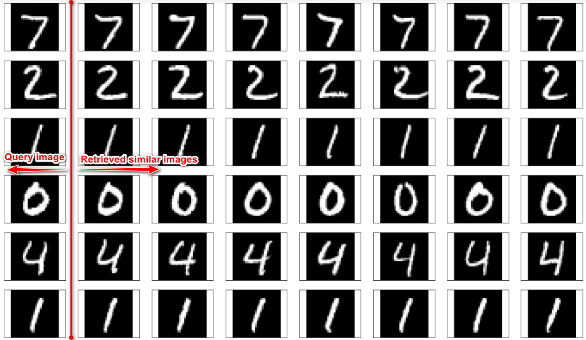

# Content-Based Image Retrieval using Autoencoder

Autoencoders work as follows:
1.  Accept an input set of data (i.e., the input)
2.  Internally compress the input data into alatent-space representation(i.e., a single vector that compresses and quantifies the input)
3.  Reconstruct the input data from this latent representation (i.e., the output)  

To build an image retrieval system with an autoencoder, what we really care about is that latent-space representation vector.  Once an autoencoder has been trained to encode images, we can:
1.  Use the encoder portion of the network to compute the latent-space representation of each image in  our  dataset  —this  representation  serves  as  our  feature  vector  that  quantifies  the contents of an image
2.  Compare the feature vector from our query image to all feature vectors in our dataset (typically we would use either the Euclidean or cosine distance)  

Feature vectors that have a smaller distance will be considered more similar, while images with a larger distance will be deemed less similar.  

We  can  then  sort  our  results  based  on  the  distance  (from  smallest  to  largest)  and  finally  display  the image retrieval results to the end user.  

# Results

